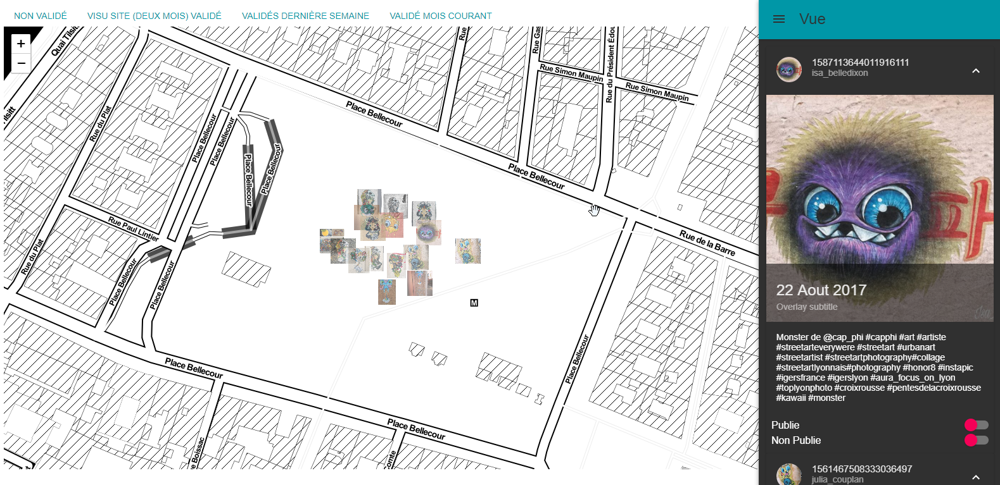

# Admin streetmap capphi map application

This application let manipulate the github geographic data stored in locations repository

see it in action : https://streetartcapphi.github.io/adminrx

## Start on the application development

Launch `webpack --watch` in a console and `webpack-dev-server`  in an other

